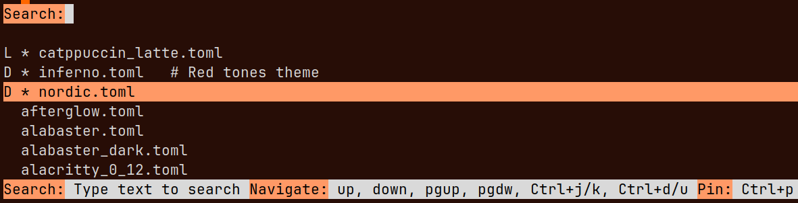

The Alacritty interactive theme selector with conveniences.

Designed to be used with the [Alacritty](https://alacritty.org/) terminal and the [oh-my-posh](https://ohmyposh.dev/) shell prompt. Reading and writing to their config files.

## Features

- Pinning a theme
- Commenting
- Marking with the light/dark
- Search name, comment, light/dark mark
- Persisting settings

### Demo screen cast

 The `alacritty-theme` command is the shell alias `select_theme.py --alacritty-themes-path=~/.config/alacritty/themes/themes --alacritty-config-path=~/.config/alacritty/alacritty.toml --posh-config-path=~/.config/kvdm.omp.toml'`

## Motivation

Once, I got really fed up with manually writing a theme file in Alacritty's config. I always ended up forgetting why I chose a specific theme in the first place. As more themes keep coming out, it’s hard to remember all of them over time. So, I thought it would be a good idea to code an interactive theme selector that lets me quickly pick a nice theme and keep my thoughts persistent about them.

## Dependencies

- `attrs`
- `cattrs`
- `prompt_toolkit`
- `tomlkit`

